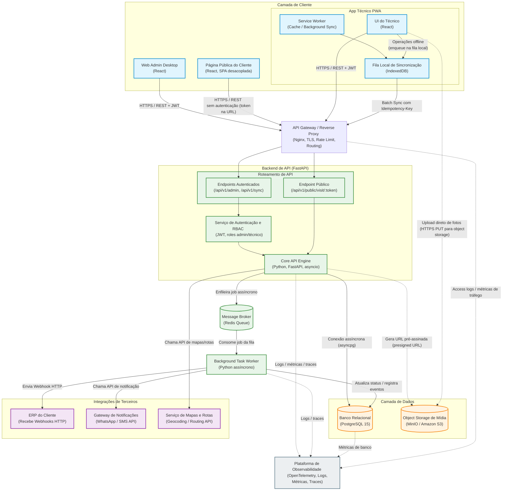

# DOCUMENTO DE ARQUITETURA

**Projeto**: FieldOps
**Autor:** Thomás D'Angelo de Almeida Gomes

## 1. Diagrama de Arquitetura de Software

<!-- O Diagrama foi projetado, construido e ajustado no "https://mermaid.ai/" -->



---

## 2. Registros de Decisão de Arquitetura (ADRs)

### ADR 01: Escolha do Framework para a API Core

- **Contexto:** A plataforma FieldOps enfrentará picos de concorrência massiva quando as equipes de campo recuperarem o sinal de internet e dispararem sincronizações de lotes simultaneamente. O painel administrativo também exige respostas rápidas e consistentes para o acompanhamento de SLAs.
- **Opções Consideradas:** 1. _Django Framework:_ Alta produtividade inicial, mas seu modelo síncrono clássico consome muita memória por conexão ativa sob alta concorrência de I/O. 2. _FastAPI:_ Framework assíncrono nativo baseado em ASGI (`asyncio`) e tipagem estrita com Pydantic.
- **Decisão:** **FastAPI**. A arquitetura assíncrona permite que uma única instância gerencie milhares de conexões concorrentes de sincronização com consumo mínimo de recursos computacionais.
- **Consequências Positivas:** Alta performance de rede, documentação automática com Swagger e validação nativa de payloads contra dados corrompidos.
- **Consequências Negativas:** O framework não possui camada de persistência de dados ou painel administrativo acoplado, exigindo a configuração manual do ORM (SQLAlchemy) e do gerenciador de migrações (Alembic).

---

### ADR 02: Estratégia de Isolamento de Dados (Multi-Tenancy)

- **Contexto:** O sistema deve atender inicialmente 50 empresas com projeção de crescimento de 10x. O vazamento de informações entre clientes (_cross-tenant_) viola os princípios da LGPD e é um risco crítico para o negócio. Contudo, os custos de infraestrutura local e de nuvem no MVP precisam ser totalmente controlados.
- **Opções Consideradas:**
  1. _Banco de Dados por Tenant:_ Uma instância física separada para cada empresa. Isolamento total, mas custo proibitivo e alta complexidade de manutenção.
  2. _Schema por Tenant (PostgreSQL Schemas):_ Separação lógica dentro do mesmo banco. Overhead elevado para executar migrações em lote no Alembic.
  3. _Schema Único com Chave Discriminadora (`company_id`):_ Compartilhamento de tabelas físicas, isolando os registros por uma coluna em comum.
- **Decisão:** **Schema Único baseado em `company_id`**. É a estratégia mais barata, portátil no Docker e que oferece escalabilidade linear previsível para a volumetria inicial.
- **Consequências Positivas:** Custo de infraestrutura reduzido a zero no ambiente local do Docker, pool de conexões otimizado e manutenibilidade simplificada com uma única base.
- **Consequências Negativas:** Eleva a responsabilidade da camada de aplicação. Um erro do desenvolvedor ao esquecer a cláusula `WHERE company_id` pode expor dados. _Mitigação:_ Implementação de dependências globais no FastAPI que injetam o filtro de tenant de forma automática e obrigatória nos repositórios.

---

### ADR 03: Arquitetura de Upload e Processamento de Mídias

- **Contexto:** Os técnicos podem anexar até 20 fotos de 5MB por visita operacional. Em um cenário de 30.000 visitas/dia, o tráfego estimado pode alcançar 3TB de binários por dia. Trafegar arquivos pesados por dentro do interpretador da API Python estrangularia a largura de banda da aplicação, causando indisponibilidade geral.
- **Opções Consideradas:**
  1. _Upload Tradicional via API:_ O PWA envia o binário para o FastAPI e o FastAPI o grava no S3. Descartado pelo alto consumo de I/O e bloqueio de threads de rede da aplicação.
  2. _Direct Upload via URLs Pré-Assinadas (Presigned URLs):_ A API emite um token de autorização temporário e o cliente faz o upload direto para o servidor de arquivos.
- **Decisão:** **Upload Direto para Object Storage (S3/MinIO) via URLs Pré-Assinadas**.
- **Consequências Positivas:** O consumo de banda e processamento de arquivos pesados na API FastAPI é reduzido a zero, permitindo que o servidor processe apenas payloads leves de JSON.
- **Consequências Negativas:** A API perde o controle síncrono sobre a finalização do upload, sendo necessário tratar o sucesso através de webhooks do storage ou notificações subsequentes do PWA.

---

### ADR 04: Mecanismo de Persistência e Sincronização Offline

- **Contexto:** A instabilidade ou ausência completa de sinal de internet celular na rotina das equipes de campo exige que o PWA continue operando de forma transparente. O técnico deve conseguir registrar transições de estado (iniciar/concluir visita) e mídias sem conectividade.
- **Opções Consideradas:**
  1. _Sincronização de Estado com LocalStorage (Last-Write-Wins cego):_ Gravação do estado final do dado localmente. Descartado devido ao limite estrito de 5MB, falta de transações complexas e risco de sobrescrever atualizações legítimas da central.
  2. _Fila de Comandos (Append-Only) baseada em IndexedDB:_ Registro sequencial das ações do técnico armazenadas localmente para reprocessamento posterior no servidor.
- **Decisão:** **Fila de Comandos local armazenada no IndexedDB**.
- **Consequências Positivas:** Armazenamento assíncrono robusto capaz de reter gigabytes de dados operacionais e arquivos (Blobs de imagens), além de preservar fielmente a cronologia dos eventos físicos ocorridos em campo.
- **Consequências Negativas:** Aumenta a complexidade de desenvolvimento no front-end, que passa a gerenciar estados assíncronos locais e precisa tratar erros de concorrência de negócios (como o status HTTP `409 Conflict`).

---

### ADR 05: Escolha do Modelo de Banco de Dados (Relacional vs. Híbrido)

- **Contexto:** O FieldOps lida com dados transacionais rígidos que exigem consistência absoluta (agendamentos de visitas, vínculos de técnicos e regras de faturamento/SLA). Paralelamente, o sistema precisa processar uma fila volumosa de tarefas em segundo plano (como logs de auditoria e simulação de notificações) sem travar as operações de leitura e escrita principais no banco de dados.
- **Opções Consideradas:** 1. _Relacional Puro (PostgreSQL isolado):_ Centralização de todas as tabelas operacionais e filas de segundo plano no mesmo disco rígido. Descartado pelo risco de gargalo de I/O em disco devido à alta concorrência de escritas simultâneas de eventos. 2. _Híbrido (PostgreSQL + Redis Queue):_ Armazenamento relacional clássico em disco combinado com um banco de dados em memória RAM ultra-rápido focado em mensageria.
- **Decisão:** **Modelo Híbrido com PostgreSQL 15 e Redis**. O PostgreSQL atua como a fonte única da verdade para dados estruturados, aproveitando campos `JSONB` para logs flexíveis de eventos. O Redis é adotado estritamente em memória para gerenciar a fila de mensageria assíncrona dos Workers locais de forma leve e com custo zero.
- **Consequências Positivas:** Isolamento total do consumo de recursos; queries operacionais na tabela de visitas permanecem rápidas porque a carga de processamento de tarefas em segundo plano roda isolada na memória RAM do Redis.
- **Consequências Negativas:** Adiciona um componente a mais na arquitetura local, exigindo o gerenciamento de dois serviços de banco de dados separados dentro do ecossistema do Docker.

---

### ADR 06: Estratégia de Autenticação e Autorização (Segurança e Controle de Acesso)

- **Contexto:** A plataforma possui três perfis de acesso com necessidades distintas: operadores administrativos com acesso total ao backoffice, técnicos de campo com acesso restrito às suas agendas diárias no PWA, e clientes finais acessando links públicos sem credenciais de login. O mecanismo de segurança deve ser leve para o tráfego do PWA e robusto contra acessos indevidos inter-inquilinos (_cross-tenant_).
- **Opções Consideradas:**
  1. _Sessões Tradicionais baseadas em Cookies:_ O servidor armazena o estado do usuário logado na memória. Descartado devido à instabilidade de rede em aplicações mobile PWA, que perdem a persistência de cookies facilmente no modo offline.
  2. _Tokens JWT (JSON Web Tokens) com Controle de Acesso Baseado em Papéis (RBAC):_ Emissão de chaves criptografadas e auto-contidas armazenadas no cliente, trafegadas via cabeçalho HTTP.
- **Decisão:** **Tokens JWT assinados com Escopos de Papéis (Roles) e UUIDv4 para Links Públicos**. O backend emite um JWT no login contendo o `company_id` e a `role` (admin ou técnico). Para o cliente final, a segurança é resolvida gerando um token em formato UUIDv4 (código de 128 bits aleatório e impossível de adivinhar) direto na URL da visita, batendo em um endpoint público que expurga dados sensíveis antes de responder.
- **Consequências Positivas:** A API FastAPI opera de forma _stateless_ (sem guardar estados de login em memória), bastando decodificar e validar a assinatura criptográfica do token a cada requisição. O isolamento de tenant fica amarrado diretamente à criptografia do token.
- **Consequências Negativas:** Por serem auto-contidos, a revogação imediata de um token JWT antes do seu tempo de expiração nativo (ex: se um celular for roubado) exige uma lógica adicional no backend, como uma lista de tokens banidos (_blacklist_) temporariamente salva no Redis.

---

## 3. Modelo de Dados

Para visualização das relações lógicas, cardinalidades e o fluxo de chaves estrangeiras centrais do ecossistema Multi-Tenant, o esquema do banco foi mapeado utilizando a especificação DBML (Database Markup Language).

<!-- O modelo de dados representa um diagrama de ER, copie e cole todo o codigo no link: "https://dbdiagram.io/" -->

```dbml
// --- Tabela de empresa ---

Table companies {
  id uuid [pk, default: `gen_random_uuid()`]
  name varchar(255) [not null]
  cnpj varchar(14) [unique, not null]
  created_at timestamp [default: `now()`]
}

// --- Tabela de "tecnicos" caso uso a role tecnico ---

Table users {
  id uuid [pk]
  company_id uuid [not null]
  name varchar(255) [not null]
  email varchar(255) [not null]
  password_hash varchar(255) [not null]
  role varchar(50) [not null, note: 'admin ou tecnico']
  is_active boolean [default: true]

  Note: 'Índice Único Composto: (company_id, email)'
}

// --- Tabela de visitas ---

Table visits {
  id uuid [pk]
  company_id uuid [not null]
  technician_id uuid [not null]
  status varchar(50) [not null, note: 'AGENDADA, EM_DESLOCAMENTO, EM_ATENDIMENTO, CONCLUIDA, CANCELADA']
  client_name varchar(255) [not null]
  address text [not null]
  public_token uuid [unique, not null, default: `gen_random_uuid()`]
  scheduled_at timestamp [not null]
  updated_at timestamp [default: `now()`]

  Note: 'Índice Composto: (company_id, status, scheduled_at)'
}

// --- Tabela de status de cada visita---

Table visit_events {
  id uuid [pk]
  company_id uuid [not null]
  visit_id uuid [not null]
  event_type varchar(50) [not null]
  description text
  idempotency_key varchar(255) [unique, not null]
  created_at timestamp [default: `now()`]

  Note: 'Tabela Particionada por Mês (Range Partitioning)'
}

// --- Tabela de anexos ---

Table visit_attachments {
  id uuid [pk]
  company_id uuid [not null]
  visit_id uuid [not null]
  file_url text [not null]
  uploaded_at timestamp [default: `now()`]
}

// --- RELACIONAMENTOS (CHAVES ESTRANGEIRAS) ---

Ref: users.company_id > companies.id [delete: cascade]
Ref: visits.company_id > companies.id [delete: cascade]
Ref: visits.technician_id > users.id
Ref: visit_events.company_id > companies.id [delete: cascade]
Ref: visit_events.visit_id > visits.id [delete: cascade]
Ref: visit_attachments.company_id > companies.id [delete: cascade]
Ref: visit_attachments.visit_id > visits.id [delete: cascade]
```

---

## 4. Mecanismo de Sincronização e Estratégia Offline do PWA

O aplicativo móvel voltado para os técnicos de campo foi projetado sob o paradigma _Offline-First_. O funcionamento do sistema é agnóstico ao estado da rede física no momento da execução da tarefa, garantindo que o técnico jamais sofra travamentos de interface ou perda de registros operacionais devido à instabilidade de sinal.

---

### 4.1 Armazenamento Local e Mecanismos Utilizados

O PWA utiliza uma estratégia combinada de persistência no navegador, dividindo as responsabilidades em dois mecanismos nativos:

- **Cache API (Gerenciado pelo Service Worker):** Utilizado para armazenar os ativos estáticos da aplicação (arquivos HTML, JavaScript, CSS, fontes e ícones de interface). Adota-se a estratégia _Cache-First_: o aplicativo é carregado instantaneamente a partir do cache local, e o Service Worker busca atualizações em segundo plano. Isso garante que o app abra e renderize as telas mesmo sem internet.
- **IndexedDB:** Banco de dados relacional local, assíncrono e transacional, utilizado para armazenar os dados de negócio. Diferente do LocalStorage (limitado a 5MB), o IndexedDB suporta gigabytes de dados, permitindo reter:
  - A listagem das visitas agendadas para o dia do técnico (massa de dados JSON).
  - A fila cronológica de comandos operacionais pendentes de envio.
  - Arquivos binários temporários (imagens capturadas convertidas em objetos `Blob`) aguardando upload.

---

### 4.2 Gerenciamento da Fila de Operações Pendentes

As ações do técnico em campo não realizam mutações destrutivas imediatas no estado da aplicação. O sistema implementa uma arquitetura baseada em **Fila de Comandos Append-Only**:

1. **Enfileiramento FIFO:** Cada clique operacional (Iniciar Deslocamento, Registrar Foto, Concluir Serviço) gera um comando JSON estruturado contendo ID da visita, timestamp do evento físico e uma `idempotency_key` (UUIDv4) imutável. Este registro é inserido no IndexedDB em uma fila do tipo FIFO (_First-In, First-Out_).
2. **Disparo Automático:** O Service Worker escuta eventos globais de conectividade (`online`) e utiliza a API de _Background Sync_. Ao detectar o retorno da internet, o Service Worker bloqueia a fila, consome os comandos em ordem cronológica exata e realiza o descarregamento em lote (_Batch Sync_) via requisição HTTP POST para o endpoint `/api/v1/sync` do backend.

---

### 4.3 Resolução de Conflitos na Sincronização

O FieldOps rejeita a abordagem cega de _Last-Write-Wins_. A inteligência de concorrência é centralizada no servidor através de uma Máquina de Estados explícita e bloqueio pessimista:

1. **Bloqueio no Banco (`SELECT FOR UPDATE`):** Ao receber o lote, o backend abre uma transação e bloqueia a linha da visita no PostgreSQL.
2. **Cenário de Conflito:** Se o técnico concluiu a visita offline, mas o operador administrativo a cancelou no painel web duas horas antes, o backend detecta que a transição de estado de `'CANCELADA'` para `'CONCLUIDA'` é ilegal.
3. **Rejeição com HTTP 409:** A transação sofre _Rollback_. O servidor rejeita o comando do técnico e responde com o status `HTTP 409 Conflict`, devolvendo o payload com os dados reais e atuais da visita no banco de dados.
4. **Tratamento do Conflito:** O PWA intercepta o erro 409, remove o comando da fila de transmissão principal (evitando o travamento do restante do lote) e move aquela visita específica para uma seção isolada de pendências da interface, preservando os dados digitados pelo técnico para fins de auditoria, sem corromper as regras financeiras do servidor.

---

### 4.4 Sinalização de Status para o Técnico (Feedback de UI)

A interface do PWA fornece dados visuais claros sobre o estado da sincronização dos dados para evitar ansiedade ou ações duplicadas do usuário:

- **Indicador Global de Conectividade:** Uma barra persistente no topo do aplicativo altera seu estado entre verde (`"Online"`) e cinza (`"Modo Offline"`) baseando-se nas escutas de rede do navegador.
- **Badge de Fila Pendente:** O ícone de sincronização exibe um contador numérico em tempo real (Ex: `[ 3 ]`), indicando quantos comandos estão acumulados no IndexedDB aguardando envio.
- **Estados Visuais por Card de Visita:** \* _Ícone de Relógio/Alerta:_ Indica que a transição de status ou a foto daquela visita específica ainda reside apenas no armazenamento local.
  - _Ícone de Check Verde:_ Indica que o lote foi processado e confirmado pelo servidor com status `200 OK`.
  - _Ícone de Alerta Vermelho (Conflito):_ Sinaliza que o comando foi rejeitado pelo servidor (Erro 409), convidando o técnico a abrir o card para visualizar a justificativa (Ex: "Esta visita foi cancelada pela central").

---

### 4.5 Limites do Modo Offline (O que NÃO funciona e por quê)

Para manter o pragmatismo técnico e a viabilidade do MVP local, as seguintes funcionalidades são explicitamente bloqueadas no modo offline:

1. **Criação de Novas Visitas Ex-tempore:** O técnico não pode criar uma nova ordem de serviço do zero se estiver sem sinal.
   - _Por quê:_ A geração de novas visitas exige a validação prévia de existência do cliente, disponibilidade de escopo e verificação de regras de negócio inter-inquilinos que residem estritamente no PostgreSQL.
2. **Visualização de Mapas de Rota Dinâmicos:** O mapa de navegação e o cálculo de rotas otimizadas ficam indisponíveis.
   - _Por quê:_ Dependem de requisições de I/O em tempo real para APIs externas de mapas (como Google Maps ou Mapbox). _Mitigação:_ O PWA exibe o endereço completo em formato de texto puro, extraído do cache do IndexedDB.
3. **Upload Físico e Processamento Imediato de Fotos:** O arquivo binário da foto não é enviado para a nuvem.
   - _Por quê:_ O envio para o Object Storage exige uma conexão ativa via HTTPS PUT. _Funcionamento local:_ O arquivo de imagem é convertido em um `Blob` (binário local), armazenado temporariamente no IndexedDB e seu upload real é postergado para quando o sinal retornar.

---

## 5. Requisitos Não-Funcionais

### 5.1 Performance e Orçamentos de Web Vitals

A experiência de uso do ecossistema é balizada por metas estritas de desempenho nas três principais métricas de Core Web Vitals do mercado:

- **TTFB (Time to First Byte - Meta: < 200ms):** Controlado no backend através do modelo assínvrono do FastAPI e do driver `asyncpg`. A performance das rotas é mantida blindada através de índices compostos que incluem a chave discriminadora `company_id`, evitando leituras sequenciais em tabelas volumosas.
- **LCP (Largest Contentful Paint - Meta: < 2.5s):** No painel Admin (Web), a velocidade de renderização do maior elemento visual é garantida via _Code Splitting_ e _Lazy Loading_ nativos do React (carregando telas e componentes sob demanda). No PWA do técnico, a estratégia _Cache-First_ do Service Worker serve a casca da aplicação instantaneamente a partir do disco local.
- **INP (Interaction to Next Paint - Meta: < 200ms):** Mede a latência de resposta da tela após a interação do usuário. É mantido baixo no PWA delegando processamentos pesados (como a compressão e conversão de fotos em Blobs) para threads secundárias via _Web Workers_, mantendo a thread principal de renderização do React livre de travamentos.

### 5.2 Segurança, Transporte e Privacidade

A proteção dos ativos de dados corporativos e individuais segue o princípio de defesa em camadas:

- **Autenticação, Autorização e Transporte:** Todo o tráfego público passa obrigatoriamente por criptografia em trânsito via protocolo **TLS (HTTPS)** gerenciado no API Gateway. O acesso a rotas protegidas exige a transmissão de tokens **JWT** via cabeçalhos HTTP. A validação de escopos (Roles) e do isolamento de inquilino (`company_id`) é interceptada por dependências nativas e obrigatórias na camada de roteamento da API.
- **Armazenamento de Fotos com PII:** As imagens anexadas podem conter dados pessoais identificáveis (PII - _Personally Identifiable Information_), como rostos de clientes ou placas de veículos. Para garantir a privacidade, as fotos residem em **buckets estritamente privados** no Object Storage (MinIO/S3). O acesso direto via URL pública é bloqueado; a visualização ocorre exclusivamente através da geração de **URLs pré-assinadas temporárias** com tempo de expiração estrito de 15 minutos, emitidas pelo backend apenas para usuários autenticados e autorizados.
- **Link Público do Cliente Final:** A rota de rastreamento do cliente final opera sem autenticação tradicional. A segurança é garantida pela alta entropia de um **token em formato UUIDv4** contido na URL (impossível de ser adivinhado ou varrido por força bruta). O endpoint correspondente atua sob o princípio da **minimização de dados**, limpando o payload e retornando apenas dados não sensíveis (status da visita e primeiro nome do técnico), omitindo CPFs, sobrenomes ou telefones.

### 5.3 Conformidade com a LGPD

O tratamento de dados na plataforma atende integralmente aos requisitos da Lei Geral de Proteção de Dados:

- **Bases Legais de Tratamento:** Os dados de identificação e contato do cliente final são tratados sob a base legal de **Execução de Contrato** (viabilização da prestação do serviço contratado). A coleta da geolocalização e histórico de eventos do técnico em campo apoia-se no **Legítimo Interesse** do controlador para fins de segurança operacional, comprovação técnica e cumprimento de acordos de nível de serviço (SLA).
- **Políticas de Retenção e Minimização:** Os dados operacionais são mantidos apenas pelo período estritamente necessário para o cumprimento de obrigações legais e contratuais. Históricos detalhados de deslocamento e eventos locais de auditoria sofrem processos automáticos de **anonimização ou expurgo definitivo** após um ciclo de retenção parametrizado (Ex: 90 dias após o encerramento fiscal da ordem).
- **Direitos do Titular (Exclusão e Portabilidade):** O sistema expõe rotas administrativas para atender a solicitações de titulares. Em caso de requisição de exclusão, os dados pessoais do cliente são mascarados no PostgreSQL (Ex: alterando para `"Cliente Anonimizado via LGPD"`), preservando a integridade financeira e estatística das visitas passadas sem armazenar dados que identifiquem o indivíduo. As fotos atreladas que contenham PII são deletadas fisicamente do Object Storage.

### 5.4 Estratégia de Observabilidade e Triagem de Falhas

O monitoramento do ecossistema é estruturado sobre os três pilares da observabilidade distribuída:

- **Logs Estruturados:** A API FastAPI e os Workers geram logs estritamente em formato **JSON** contendo metadados unificados (`tenant_id`, `user_id`, `request_id`, `timestamp`). As mensagens são centralizadas em ferramentas de agregação (como Grafana Loki ou ELK Stack), eliminando o uso de prints e logs de texto livre.
- **Métricas Operacionais:** Coleta contínua de telemetria de infraestrutura (uso de CPU e memória RAM dos containers do Docker) e de aplicação (tempo médio de resposta das rotas, contagem de erros HTTP 5XX e tamanho da fila de mensageria no Redis), expostas nativamente para raspagem do **Prometheus** e exibidas em painéis do **Grafana**.
- **Traces Distribuídos:** Implementados via **OpenTelemetry** e correlacionados através de um cabeçalho único (`X-Request-ID`). Permitem rastrear uma requisição de sincronização desde o momento em que bate no API Gateway, passa pelos middlewares do FastAPI, executa instruções no PostgreSQL e enfileira uma tarefa no Redis.
- **Alertas e Triagem de Incidentes:** Alertas são disparados para canais de engenharia caso a taxa de erros HTTP 5XX ultrapasse 1% ou o tempo de resposta da API exceda o orçamento de performance. Em caso de falha sistêmica, o protocolo de triagem consiste em verificar primeiro o **Painel de Tráfego do Gateway** (para isolar problemas de rede), seguido pelas **Métricas de Conexão do Banco de Dados**, isolando o erro definitivo através do rastreamento do `request_id` nos **Logs Estruturados** do serviço afetado.

### 5.5 Governança e Controle de Custos de Infraestrutura

Para viabilizar a estabilidade financeira durante o crescimento projetado de 10x na volumetria, os principais gargalos de custo foram mitigados na raiz da arquitetura:

- **Gargalo de Armazenamento e Banda de Rede (Mídias):** O upload de 20 fotos de 5MB por visita em uma escala de 30k visitas/dia geraria custos abusivos de tráfego de dados. _Mecanismo de Controle:_ O PWA realiza a **compressão e redimensionamento físico da imagem no lado do cliente** utilizando APIs de Canvas do navegador antes de disparar o upload. A resolução é reduzida e o arquivo é compactado de 5MB para um teto máximo de 500KB (uma redução de 90% no custo de armazenamento no S3/MinIO e em transferência de dados de rede), preservando a legibilidade para comprovação técnica.
- **Gargalo de Processamento de Banco de Dados (PostgreSQL):** A varredura de índices em tabelas de auditoria (Timeline de Eventos) contendo dezenas de milhões de linhas causaria exaustão de CPU e exigiria atualizações caras de hardware (escala vertical). _Mecanismo de Controle:_ A adoção do **particionamento por faixa de tempo (mensal)** isola as escritas e leituras na partição corrente. Aliado ao cache de leituras pesadas e repetitivas (como configurações de inquilinos e listagem de usuários ativos) gerenciado na memória RAM do **Redis**, o banco de dados relacional principal permanece leve, portável e estável com baixo consumo computacional.

---

## 6. Roadmap de Implementação e Evolução do Produto

O plano de entrega da plataforma FieldOps adota uma abordagem incremental, focando primeiro na validação do fluxo crítico de valor do negócio para, em seguida, expandir a robustez, os recursos offline avançados e a otimização para a escala de 10x.

### 6.1 Fase 1: MVP (Mínimo Produto Viável) - Validação do Core Transacional

O objetivo desta fase é validar a comunicação de ponta a ponta entre a central e o campo em cenários com conectividade estável, garantindo a governança básica.

- **Escopo do Backend:** API em FastAPI com tabelas centrais (`companies`, `users`, `visits`), autenticação simples via JWT e injeção do isolamento por linha via `company_id`.
- **Escopo do PWA (Técnico):** Interface básica carregando a listagem de visitas do dia e permitindo transições de status simples (Iniciar/Concluir), operando de forma estritamente online.
- **Escopo do Web Admin:** Painel simplificado para o operador cadastrar empresas, usuários e agendar ordens de serviço.
- **Exclusões Técnicas:** Modo offline do PWA, uploads de fotos pesadas, links públicos para o cliente final e o sistema de filas por Redis Queue (as tarefas rodam de forma síncrona).

### 6.2 Fase 2: V1 (Pronto para o Mundo Real) - Robustez e Resiliência Offline

Esta fase adapta o sistema para as condições hostis de campo, cobrindo 90% das dores operacionais e requisitos de auditoria exigidos.

- **Escopo do PWA (Técnico):** Implementação completa do Service Worker (Cache API para carregar o app offline) e da Fila FIFO de Comandos no IndexedDB. Captura de fotos convertidas em Blobs locais.
- **Escopo do Backend:** Ativação do endpoint de sincronização em lote (`/sync`), validação atômica via Máquina de Estados com bloqueio pessimista (`SELECT FOR UPDATE`) e tratamento de erros HTTP 409. Emissão de URLs pré-assinadas para upload direto no MinIO/S3.
- **Escopo de Segurança e Cliente:** Geração do link público criptografado via UUIDv4 para o cliente final acompanhar o status da visita com minimização de dados (LGPD).
- **Exclusões Técnicas:** Integrações automatizadas com ERPs externos via webhooks e ferramentas complexas de observabilidade distribuída.

### 6.3 Fase 3: V2 (Escala e Ecossistema) - Alta Disponibilidade e Integrações B2B

Foco total na eficiência de custos para suportar o crescimento de 10x (300k visitas/dia) e na abertura da plataforma para ecossistemas de grandes clientes.

- **Otimização de Infraestrutura:** Ativação do particionamento mensal por faixa de tempo na tabela `visit_events` do PostgreSQL. Implementação de cache de leitura no Redis para dados estáticos de tenants e usuários.
- **Mensageria e Background Jobs:** Ativação do Redis Queue e dos Background Workers assíncronos para isolar os disparos de webhooks e simulação de notificações fora do fluxo principal da API.
- **Ecossistema de APIs:** Abertura de endpoints públicos para que os ERPs das empresas clientes possam agendar visitas ou receber webhooks automáticos de conclusão de serviços.

---

### 6.4 Marco Crucial: Checklist da "Primeira Semana em Produção Real" (Cliente Piloto)

Para colocar o primeiro cliente em produção (composto por 1 empresa e 5 técnicos monitorados) logo na primeira segunda-feira, o escopo técnico do MVP (Fase 1) precisa estar acompanhado de salvaguardas mínimas de infraestrutura e operação:

1. **Infraestrutura Mínima de Produção (Nuvem):** O backend FastAPI e o banco de dados PostgreSQL devem estar rodando em ambiente de nuvem real, protegidos obrigatoriamente por HTTPS (TLS), garantindo a criptografia dos dados em trânsito.
2. **Ambientes e Configurações via Environment Variables:** Separação estrita de credenciais. O sistema deve ler chaves, senhas de banco e URLs de serviços através de variáveis de ambiente (`.env`), sem dados sensíveis expostos no código.
3. **Esteira de CI/CD Mínima:** Automação via GitHub Actions para rodar testes unitários básicos e realizar o deploy automático no servidor de produção assim que o código sofrer correções na branch principal.
4. **Plano de Contingência Operacional (Suporte Técnico):** Criação de um canal direto de comunicação (Ex: grupo de suporte) com os 5 técnicos do piloto e monitoramento manual de logs no servidor pelo desenvolvedor durante as primeiras 8 horas de operação em campo. Caso o aplicativo sofra um bug crítico de travamento, um formulário ou planilha manual de contingência deve estar impresso com os técnicos para que o trabalho na rua não pare enquanto o patch de correção é aplicado via CI/CD.
