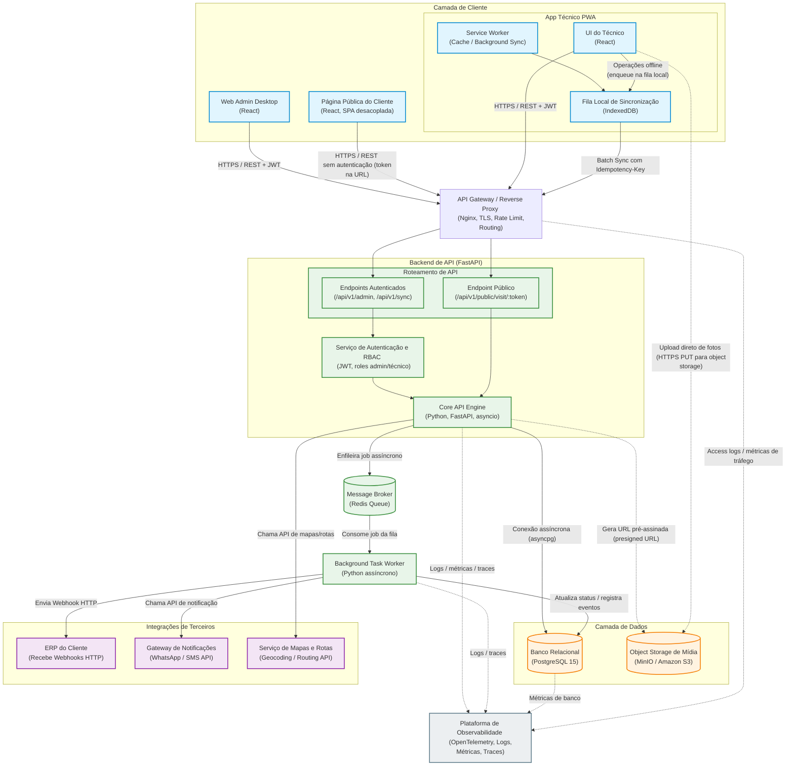

# DOCUMENTO DE ARQUITETURA

**Projeto**: FieldOps
**Autor:** Thomás D'Angelo de Almeida Gomes

### Visão alvo vs solução entregue

Este documento descreve a **arquitetura alvo** da FieldOps (pensada para escala 10x, integrações e observabilidade completa).  
A implementação do desafio prático, porém, entrega uma **MVP/V1 local** mais enxuta, focada em:

- Backend em FastAPI + PostgreSQL.
- Web Admin em React.
- PWA do técnico em React com fila offline.
- Página pública do cliente por token.
- Upload de fotos em disco local servidas pelo próprio backend.

Elementos como MinIO/S3, Redis Queue, workers de background, integrações com ERP/WhatsApp e stack completa de observabilidade aparecem como **evolução planejada (V2 +)** e não fazem parte da entrega atual.  
Essa separação é deliberada: a prova pede uma fatia vertical funcional; o documento registra como essa fatia evolui sem reescrita total.

## 1. Diagrama de Arquitetura de Software

Este diagrama representa a arquitetura alvo da FieldOps (V2). A implementação do desafio prático entrega um subconjunto reduzido (MVP/V1), descrito no Roadmap e detalhado no NOTAS.md.

<!-- O Diagrama foi projetado, construido e ajustado no "https://mermaid.ai/" -->



---

## 2. Registros de Decisão de Arquitetura (ADRs)

### ADR 01: Escolha do Framework para a API Core

- **Contexto:** A plataforma FieldOps enfrentará picos de concorrência massiva quando as equipes de campo recuperarem o sinal de internet e dispararem sincronizações de lotes simultaneamente. O painel administrativo também exige respostas rápidas e consistentes para o acompanhamento de SLAs.
- **Opções Consideradas:** 1. _Django Framework:_ Alta produtividade inicial, mas seu modelo síncrono clássico consome muita memória por conexão ativa sob alta concorrência de I/O. 2. _FastAPI:_ Framework assíncrono nativo baseado em ASGI (`asyncio`) e tipagem estrita com Pydantic.
- **Decisão:** **FastAPI**. A arquitetura assíncrona permite que uma única instância gerencie milhares de conexões concorrentes de sincronização com consumo mínimo de recursos computacionais.
- **Consequências Positivas:** Alta performance de rede, documentação automática com Swagger e validação nativa de payloads contra dados corrompidos.
- **Consequências Negativas:** O framework não possui camada de persistência de dados ou painel administrativo acoplado, exigindo a configuração manual do ORM (SQLAlchemy) e do gerenciador de migrações (Alembic).

---

### ADR 02: Estratégia de Isolamento de Dados (Multi-Tenancy)

- **Contexto:** O sistema deve atender inicialmente 50 empresas com projeção de crescimento de 10x. O vazamento de informações entre clientes (_cross-tenant_) viola os princípios da LGPD e é um risco crítico para o negócio. Contudo, os custos de infraestrutura local e de nuvem no MVP precisam ser totalmente controlados.
- **Opções Consideradas:**
  1. _Banco de Dados por Tenant:_ Uma instância física separada para cada empresa. Isolamento total, mas custo proibitivo e alta complexidade de manutenção.
  2. _Schema por Tenant (PostgreSQL Schemas):_ Separação lógica dentro do mesmo banco. Overhead elevado para executar migrações em lote no Alembic.
  3. _Schema Único com Chave Discriminadora (`company_id`):_ Compartilhamento de tabelas físicas, isolando os registros por uma coluna em comum.
- **Decisão:** **Schema Único baseado em `company_id`**. É a estratégia mais barata, portátil no Docker e que oferece escalabilidade linear previsível para a volumetria inicial.
- **Consequências Positivas:** Custo de infraestrutura reduzido a zero no ambiente local do Docker, pool de conexões otimizado e manutenibilidade simplificada com uma única base.
- **Consequências Negativas:** Eleva a responsabilidade da camada de aplicação. Um erro do desenvolvedor ao esquecer a cláusula `WHERE company_id` pode expor dados. _Mitigação:_ Implementação de dependências globais no FastAPI que injetam o filtro de tenant de forma automática e obrigatória nos repositórios.

---

### ADR 03: Arquitetura de Upload e Processamento de Mídias

- **Contexto:** Técnicos podem anexar até 20 fotos de 5 MB por visita. Em 30.000 visitas/dia, a volumetria de mídia cresce rápido. A arquitetura precisa ser preparada para não estrangular a API com tráfego de binários.
- **Opções Consideradas (arquitetura alvo):**
  - **Upload tradicional via API:** O PWA envia o binário para FastAPI, que o envia para S3/MinIO. Gera forte acoplamento entre API e I/O de arquivos.
  - **Upload direto via URLs pré-assinadas (presigned URLs):** A API emite um token/URL temporária e o cliente faz upload direto para object storage.
- **Decisão (visão alvo):** **Upload direto para object storage (MinIO/S3) via URLs pré-assinadas**.  
  Nessa visão, o backend lida apenas com JSON leve (metadados), e o armazenamento de mídia fica a cargo de um serviço especializado.

- **Implementação atual na V1 (desafio prático):**
  - Upload de fotos via endpoint FastAPI (recebendo `UploadFile`).
  - Salvando o arquivo em **disco local** no container.
  - Expondo as imagens via rota estática (`/static/...`).
  - Armazenando apenas `file_url` no banco (`visit_attachments.file_url`).

- **Motivo do recorte na V1:**
  - Menos componentes para o avaliador subir via `docker-compose`.
  - Debugging simples (é possível ver os arquivos no volume local).
  - Mantém o contrato preparado para migração: o banco guarda apenas URLs, então trocar o backend de storage depois é transparente para o PWA.

- **Consequências Positivas da visão alvo:** Reduz carga de I/O na API, melhora escalabilidade e permite usar features nativas de object storage (versionamento, lifecycle, etc.).
- **Consequências Negativas da visão alvo:** Necessidade de coordenar upload assíncrono (eventos de sucesso/falha), aumento da complexidade de configuração (buckets, credenciais, permissões) e dependência de mais um componente na infraestrutura.

---

### ADR 04: Mecanismo de Persistência e Sincronização Offline

- **Contexto:** A instabilidade ou ausência completa de sinal de internet celular na rotina das equipes de campo exige que o PWA continue operando de forma transparente. O técnico deve conseguir registrar transições de estado (iniciar/concluir visita) e mídias sem conectividade.
- **Opções Consideradas:**
  - _Sincronização de Estado com LocalStorage (Last-Write-Wins cego):_ Gravação do estado final do dado localmente. Descartado devido ao limite estrito de 5MB, falta de transações complexas e risco de sobrescrever atualizações legítimas da central.
  - _Fila de Comandos (Append-Only) baseada em IndexedDB:_ Registro sequencial das ações do técnico armazenadas localmente para reprocessamento posterior no servidor.
- **Decisão (visão alvo):** **Fila de comandos local em IndexedDB (append-only)**:
  - Cada ação gera um comando com `idempotency_key`.
  - O Service Worker usa Background Sync para enviar lotes quando a conexão volta.
  - O endpoint `/sync` processa os eventos em lote.

- **Implementação atual na V1 (desafio prático):**
  - A fila de eventos é armazenada em `localStorage`, indexada por email do técnico (`fieldops_queue_<email>`).
  - Cada item da fila contém `visit_id`, `event_type`, `description`, `status_to_apply`, `idempotency_key`, etc.
  - O PWA, ao detectar que está online, percorre essa fila e envia:
    - Eventos de status para o endpoint `/sync`.
    - Fotos para o endpoint de anexos da visita.
  - Não há uso de IndexedDB nem Background Sync ainda; o foco foi garantir a lógica de fila, idempotência e tratamento de conflito com a API.

- **Motivo do recorte na V1:**
  - Implementar uma camada de IndexedDB bem feita e testada exigiria mais tempo do que o disponível.
  - A prova valoriza mais a **estrutura do fluxo offline** (fila, idempotência, conflitos) do que a tecnologia exata de storage local.
  - `localStorage` foi usado como compromisso pragmático para V1.

- **Plano de evolução:**
  - Substituir o backend da fila de eventos (hoje `localStorage`) por IndexedDB, mantendo o formato das mensagens e o uso de `idempotency_key`.

- **Consequências Positivas:** Armazenamento assíncrono robusto capaz de reter gigabytes de dados operacionais e arquivos (Blobs de imagens), além de preservar fielmente a cronologia dos eventos físicos ocorridos em campo. A `idempotency_key` garante que, mesmo em reenvios parciais, o servidor nunca duplique um evento.
- **Consequências Negativas:** Aumenta a complexidade de desenvolvimento no front-end, que passa a gerenciar estados assíncronos locais, tratar erros de concorrência de negócios (`HTTP 409 Conflict`) e manter a consistência entre o estado do IndexedDB e o estado visual exibido na interface.

---
### ADR 05: Escolha do Modelo de Banco de Dados (Relacional vs. Híbrido)

- **Contexto:** O FieldOps lida com dados transacionais rígidos que exigem consistência absoluta (agendamentos de visitas, vínculos de técnicos e regras de faturamento/SLA). Paralelamente, o sistema precisa processar uma fila volumosa de tarefas em segundo plano (como logs de auditoria e simulação de notificações) sem travar as operações de leitura e escrita principais no banco de dados.
- **Opções Consideradas:** 
  - **Relacional Puro (PostgreSQL isolado):** Centralização de todas as tabelas operacionais e filas de segundo plano no mesmo disco rígido. Descartado pelo risco de gargalo de I/O em disco devido à alta concorrência de escritas simultâneas de eventos. 
  - **Híbrido (PostgreSQL + Redis Queue):** Armazenamento relacional clássico em disco combinado com um banco de dados em memória RAM ultra-rápido focado em mensageria.
- **Decisão (visão alvo):** **Modelo híbrido com PostgreSQL e Redis**:
  - Postgres como fonte de verdade, com campos `JSONB` para flexibilidade.
  - Redis como fila em memória para mensageria e background jobs.

- **Implementação atual na V1:**
  - Apenas PostgreSQL está em uso.
  - Não há Redis nem workers de background.
  - Webhooks e notificações são parte da visão de futuro, não do escopo atual.

- **Justificativa:**  
  Para o desafio, a prioridade é entregar o fluxo de visita ponta a ponta. Adicionar Redis e um worker completo aumentaria complexidade da infraestrutura local e o risco de falhas sem aumentar proporcionalmente o valor demonstrado.

- **Consequências Positivas:** Isolamento total do consumo de recursos; queries operacionais na tabela de visitas permanecem rápidas porque a carga de processamento de tarefas em segundo plano roda isolada na memória RAM do Redis.
- **Consequências Negativas:** Adiciona um componente a mais na arquitetura local, exigindo o gerenciamento de dois serviços de banco de dados separados dentro do ecossistema do Docker.

---

### ADR 06: Estratégia de Autenticação e Autorização (Segurança e Controle de Acesso)

- **Contexto:** A plataforma possui três perfis de acesso com necessidades distintas: operadores administrativos com acesso total ao backoffice, técnicos de campo com acesso restrito às suas agendas diárias no PWA, e clientes finais acessando links públicos sem credenciais de login. O mecanismo de segurança deve ser leve para o tráfego do PWA e robusto contra acessos indevidos inter-inquilinos (_cross-tenant_).
- **Opções Consideradas:**
  1. _Sessões Tradicionais baseadas em Cookies:_ O servidor armazena o estado do usuário logado na memória. Descartado devido à instabilidade de rede em aplicações mobile PWA, que perdem a persistência de cookies facilmente no modo offline.
  2. _Tokens JWT (JSON Web Tokens) com Controle de Acesso Baseado em Papéis (RBAC):_ Emissão de chaves criptografadas e auto-contidas armazenadas no cliente, trafegadas via cabeçalho HTTP.
- **Decisão:** **Tokens JWT assinados com Escopos de Papéis (Roles) e UUIDv4 para Links Públicos**. O backend emite um JWT no login contendo o `company_id` e a `role` (admin ou técnico). Para o cliente final, a segurança é resolvida gerando um token em formato UUIDv4 (código de 128 bits aleatório e impossível de adivinhar) direto na URL da visita, batendo em um endpoint público que expurga dados sensíveis antes de responder.
- **Consequências Positivas:** A API FastAPI opera de forma _stateless_ (sem guardar estados de login em memória), bastando decodificar e validar a assinatura criptográfica do token a cada requisição. O isolamento de tenant fica amarrado diretamente à criptografia do token.
- **Consequências Negativas:** Por serem auto-contidos, a revogação imediata de um token JWT antes do seu tempo de expiração nativo (ex: se um celular for roubado) exige uma lógica adicional no backend, como uma lista de tokens banidos (_blacklist_) temporariamente salva no Redis.

---

## 3. Modelo de Dados

Para visualização das entidades centrais e suas relações em um cenário multi-tenant, utilizo DBML (Database Markup Language).

<!-- O modelo de dados representa um diagrama de ER, copie e cole todo o codigo no link: "https://dbdiagram.io/" -->

```dbml
// --- Tabela de empresa ---

Table companies {
  id uuid [pk, default: `gen_random_uuid()`]
  name varchar(255) [not null]
  cnpj varchar(14) [unique, not null]
  created_at timestamp [default: `now()`]
}

// --- Tabela de "tecnicos" caso uso a role tecnico ---

Table users {
  id uuid [pk]
  company_id uuid [not null]
  name varchar(255) [not null]
  email varchar(255) [not null]
  password_hash varchar(255) [not null]
  role varchar(50) [not null, note: 'admin ou tecnico']
  is_active boolean [default: true]

  Note: 'Índice Único Composto: (company_id, email)'
}

// --- Tabela de visitas ---

Table visits {
  id uuid [pk]
  company_id uuid [not null]
  technician_id uuid [not null]
  status varchar(50) [not null, note: 'AGENDADA, EM_DESLOCAMENTO, EM_ATENDIMENTO, CONCLUIDA, CANCELADA']
  client_name varchar(255) [not null]
  address text [not null]
  public_token uuid [unique, not null, default: `gen_random_uuid()`]
  scheduled_at timestamp [not null]
  updated_at timestamp [default: `now()`]

  Note: 'Índice Composto: (company_id, status, scheduled_at)'
}

// --- Tabela de status de cada visita---

Table visit_events {
  id uuid [pk]
  company_id uuid [not null]
  visit_id uuid [not null]
  event_type varchar(50) [not null]
  description text
  idempotency_key varchar(255) [unique, not null]
  created_at timestamp [default: `now()`]

  Note: 'Tabela Particionada por Mês (Range Partitioning)'
}

// --- Tabela de anexos ---

Table visit_attachments {
  id uuid [pk]
  company_id uuid [not null]
  visit_id uuid [not null]
  file_url text [not null]
  uploaded_at timestamp [default: `now()`]
}

// --- RELACIONAMENTOS (CHAVES ESTRANGEIRAS) ---

Ref: users.company_id > companies.id [delete: cascade]
Ref: visits.company_id > companies.id [delete: cascade]
Ref: visits.technician_id > users.id
Ref: visit_events.company_id > companies.id [delete: cascade]
Ref: visit_events.visit_id > visits.id [delete: cascade]
Ref: visit_attachments.company_id > companies.id [delete: cascade]
Ref: visit_attachments.visit_id > visits.id [delete: cascade]
```

Na V1, este modelo já está implementado com:

- `companies` como tenant principal.
- `users` com `company_id` e `role`.
- `visits` com `company_id`, `technician_id`, `status`, `public_token`.
- `visit_events` com `idempotency_key` e partição planejada por tempo.
- `visit_attachments` com `file_url` apontando para o backend de storage atual (disco).

---

## 4. Mecanismo de Sincronização e Estratégia Offline do PWA

O aplicativo voltado para os técnicos de campo foi projetado sob o paradigma **Offline-First**, mas a implementação atual prioriza um fluxo consistente com o tempo de prova.  
O objetivo é garantir que o técnico consiga operar mesmo com sinal instável, sem travamentos de interface ou perda de registros.

---

### 4.1 Armazenamento Local e Mecanismos Utilizados

**Visão alvo:**

- **Cache API + Service Worker:**  
  Responsáveis por armazenar os ativos estáticos da aplicação (HTML, JS, CSS, fontes, ícones).  
  Estratégia _Cache-First_: o app carrega a partir do cache local e o Service Worker busca atualizações em segundo plano, permitindo abertura do app mesmo sem internet.

- **IndexedDB:**  
  Banco local assíncrono usado para:
  - Persistir a lista de visitas do dia do técnico.
  - Armazenar a fila cronológica de comandos operacionais pendentes de envio.
  - Guardar arquivos binários temporários (imagens em `Blob`) aguardando upload.

**Implementação V1:**

- O PWA já utiliza manifest/Service Worker para ser instalável e suportar cache básico de assets.
- A fila de eventos do técnico é armazenada em `localStorage` (chave por email do usuário).
- A lista de visitas é carregada via API e mantida em memória; em modo offline, os cards já carregados continuam visíveis enquanto o app permanece aberto.

---

### 4.2 Fila de Operações Pendentes

Conceitualmente, o sistema segue uma arquitetura de **Fila de Comandos Append-Only**:

1. Cada ação operacional relevante (iniciar deslocamento, registrar foto, concluir serviço) gera um comando JSON contendo:
   - `visit_id`,
   - timestamp do evento físico,
   - `event_type`,
   - campos auxiliares (por exemplo `status_to_apply`),
   - uma `idempotency_key` (UUIDv4) imutável.
2. Esses comandos são enfileirados em uma estrutura FIFO (_First-In, First-Out_), para posterior reprocessamento no servidor em ordem cronológica.

**Na prática (V1):**

- Cada ação relevante gera uma entrada na fila em `localStorage`.
- Quando a aplicação detecta que voltou a ficar online, percorre essa fila e:
  - envia os eventos de status para o endpoint `/api/v1/sync`;
  - envia anexos/fotos para o endpoint específico de anexos de visita.
- A API `/sync` aplica os eventos utilizando a `idempotency_key` para evitar duplicações de processamento.

---

### 4.3 Resolução de Conflitos na Sincronização

O FieldOps evita a estratégia cega de _Last-Write-Wins_. A resolução de concorrência é centralizada no backend por meio de uma máquina de estados explícita e validações de negócio.

**No backend:**

1. Ao receber um lote de eventos, a API valida o estado atual da visita no PostgreSQL antes de aplicar cada comando.
2. Se a transição solicitada for ilegal (por exemplo, visita marcada como `'CANCELADA'` pelo admin e depois `'CONCLUIDA'` pelo técnico offline), o comando é rejeitado.
3. Nesses casos, o servidor responde com `HTTP 409 Conflict`, retornando também o estado atual e válido da visita para o cliente.

**No PWA:**

- Em caso de `HTTP 409`, o evento correspondente:
  - é marcado como conflito e não é reaplicado;
  - não bloqueia o restante do lote de sync;
  - faz com que a visita seja sinalizada na UI como pendente de intervenção, permitindo que o técnico veja a justificativa retornada pelo backend.

---

### 4.4 Feedback de UI para o Técnico

Na V1, a interface do PWA já oferece feedback visual suficiente para que o técnico entenda o estado de sincronização e evite ações duplicadas:

- Indicação de modo offline/online (por meio de banners/indicadores visuais).
- Sinalização de que existem operações pendentes de envio (badge/contador de fila).
- Estados visuais diferenciados para:
  - eventos em fila ainda não sincronizados;
  - eventos sincronizados com sucesso;
  - eventos em conflito (erros de negócio, como `HTTP 409`).

**Evolução planejada da experiência:**

- Barra persistente de conectividade no topo do aplicativo, com estados claros (por exemplo “Online” em verde, “Modo Offline” em cinza).
- Badge numérico em tempo real associado à fila local, indicando quantos comandos aguardam envio.
- Estados visuais por card de visita, diferenciando explicitamente:
  - pendência local (evento ainda só no dispositivo),
  - sincronização concluída,
  - conflito rejeitado pelo backend (`HTTP 409`).

---

### 4.5 Limites do Modo Offline (O que NÃO funciona e por quê)

Para manter o pragmatismo técnico e a viabilidade da V1 local, algumas funcionalidades são deliberadamente bloqueadas ou degradadas em modo offline:

1. **Criação de novas visitas ex-tempore:**  
   O técnico não pode criar uma nova ordem de serviço do zero sem sinal.  
   _Motivo:_ a criação exige validações de cliente, escopo e regras de negócio que dependem do PostgreSQL e de regras de multi-tenant no backend.

2. **Visualização de mapas de rota dinâmicos:**  
   Mapas e rotas otimizadas não são exibidos offline.  
   _Motivo:_ dependem de chamadas em tempo real a APIs externas de mapas.  
   _Mitigação:_ o PWA exibe o endereço textual completo (já carregado) para que o técnico possa usar outros meios de navegação.

3. **Upload físico imediato de fotos para storage remoto:**  
   Em modo offline, o upload efetivo para o backend/storage não ocorre.  
   _Motivo:_ o envio para object storage exige conexão HTTPS ativa.  
   _Funcionamento na V1:_ a foto é anexada logicamente à visita (evento e/ou payload local) e permanece associada à fila de sincronização; o envio real ocorre quando a conexão é restabelecida e o fluxo de sync é disparado novamente.

---

## 5. Requisitos Não-Funcionais

### 5.1 Performance e Orçamentos de Web Vitals

A experiência de uso do ecossistema é balizada pelas três principais métricas de Core Web Vitals, com metas definidas como **visão alvo**, mas já guiando decisões da V1.

**Metas de referência (visão alvo):**

- **TTFB (Time to First Byte) < 200 ms:**  
  Alcançado combinando FastAPI assíncrono com driver `asyncpg` e índices compostos que incluem `company_id`, evitando varreduras completas em tabelas multi-tenant.
- **LCP (Largest Contentful Paint) < 2,5 s:**  
  - No Web Admin: uso de _code splitting_ e _lazy loading_ de telas em React, carregando apenas o necessário para o primeiro paint.  
  - No PWA: shell da aplicação servido a partir da cache do Service Worker (_Cache-First_), permitindo que a UI principal apareça mesmo com rede lenta.
- **INP (Interaction to Next Paint) < 200 ms:**  
  Metas de interação fluida, especialmente em ações de status de visita e anexos de fotos, delegando futuras tarefas pesadas (como compressão de imagem) para Web Workers para não bloquear a thread principal.

**V1 do desafio:**

- Backend FastAPI com driver assíncrono para PostgreSQL e índices básicos focados em queries por `company_id` e `status`.
- Frontends em React com divisão de bundles básica (importação dinâmica de páginas) para reduzir o peso inicial.
- PWA com cache de assets via Service Worker, garantindo que, após o primeiro acesso, o carregamento subsequente seja sensivelmente mais rápido.

Funcionalidades como compressão avançada de fotos no lado do cliente e uso de Web Workers dedicados para isso fazem parte da visão de produção e ainda não estão totalmente implementadas na V1; o design atual foi feito para permitir essa evolução sem quebra de contrato.

---

### 5.2 Segurança, Transporte e Privacidade

A proteção de dados segue o princípio de **defesa em camadas**, com foco em:

- **Transporte seguro:**  
  Em produção, todo tráfego passa obrigatoriamente por **TLS (HTTPS)**, tipicamente terminação no gateway reverso. Na V1 local, isso é simulado no ambiente de desenvolvimento, mas o código já assume URLs HTTPS para ambientes reais.
- **Autenticação e autorização:**  
  - Rotas protegidas exigem tokens **JWT** enviados em cabeçalhos HTTP.  
  - Cada token carrega `company_id` e `role` (admin/técnico), permitindo que o backend aplique RBAC e isolamento de tenant a partir do próprio token.
- **Isolamento de tenant:**  
  Dependências de rota no backend garantem que o `company_id` presente no JWT seja aplicado como filtro obrigatório nas consultas, evitando cross-tenant.
- **Links públicos:**  
  A página do cliente final utiliza um `public_token` em formato UUID, de alta entropia, como mecanismo principal de segurança. O endpoint público aplica o princípio de **minimização de dados**, retornando apenas informações estritamente necessárias (por exemplo, status da visita e identificação mínima do técnico).

No contexto da V1 local, a ênfase está em:
- Validar JWTs em todas as rotas sensíveis.
- Garantir que os endpoints públicos jamais retornem dados que identifiquem plenamente o cliente (sem CPFs, telefones ou sobrenomes).

---

### 5.3 Conformidade com a LGPD

O desenho da plataforma foi feito para atender à **Lei Geral de Proteção de Dados** desde o início, mesmo que algumas rotas administrativas de gestão de dados ainda não estejam implementadas na V1.

**Pontos principais da visão alvo:**

- **Bases legais de tratamento:**
  - Dados de identificação/contato do cliente final: base de **execução de contrato** (viabilizar a prestação do serviço).
  - Dados de geolocalização e histórico de eventos do técnico: **legítimo interesse** do controlador para segurança operacional, auditoria e cumprimento de SLA.
- **Retenção e minimização:**
  - Dados operacionais são mantidos apenas pelo tempo necessário para obrigações legais e contratuais.
  - Históricos detalhados (por exemplo, timeline de eventos) sofrem processos automáticos de anonimização ou expurgo após um período configurável (ex.: 90 dias após o fechamento fiscal da ordem).
- **Direitos do titular:**
  - Em caso de solicitação de exclusão, o sistema substitui dados pessoais (nome, identificadores) por marcadores neutros (por exemplo `"Cliente Anonimizado via LGPD"`), preservando consistência financeira e estatística.
  - Fotos com PII são removidas fisicamente do storage ao atender pedidos de exclusão.

**Estado da V1:**

- O modelo de dados já separa claramente:
  - Dados operacionais (visitas, eventos, anexos).
  - Dados pessoais (nome do cliente, etc.).
- As rotas específicas para anonimização em lote e portabilidade ainda não foram implementadas, mas o schema foi pensado para suportar essas operações sem alterações estruturais significativas.

---

### 5.4 Estratégia de Observabilidade e Triagem de Falhas

**Visão alvo de observabilidade distribuída:**

- **Logs estruturados:**  
  Toda API e worker emite logs em formato JSON, com campos padrão (`tenant_id`, `user_id`, `request_id`, `timestamp`). Esses logs são enviados para uma stack de agregação (Grafana Loki, ELK, etc.).
- **Métricas:**  
  Coleta de métricas de infraestrutura (CPU, RAM, conexões de banco) e de aplicação (latência por rota, taxa de erros 4xx/5xx, tamanho da fila de mensagens).
- **Traces distribuídos:**  
  Implementados com OpenTelemetry, utilizando um identificador único (`X-Request-ID`) para traçar a jornada de uma requisição desde o gateway até o banco e os workers.
- **Alertas:**  
  Regras de alerta (por exemplo, erro 5xx > 1% ou p95 de latência acima da meta) enviam notificações para canais de engenharia e disparam protocolos de triagem.

**V1 do desafio:**

- Logs ainda são basicamente texto/stdout e inspecionados manualmente, de forma suficiente para o ambiente local da prova.
- Não há stack completa de métricas/traces configurada; em vez disso, o foco foi garantir:
  - mensagens de erro claras no backend,
  - comportamento previsível em caso de falhas de sync,
  - e logs suficientes para depuração local.

O documento registra a direção de evolução, mas não finge que essa stack está pronta na V1.

---

### 5.5 Governança e Controle de Custos de Infraestrutura

A arquitetura alvo foi desenhada com preocupações explícitas de custo, principalmente em mídia e banco de dados.

**Visão alvo:**

- **Mídias (fotos):**
  - Compressão e redimensionamento de imagens no cliente (via canvas/Web Workers) para reduzir arquivos de ~5 MB para ~500 KB.
  - Upload direto para object storage (MinIO/S3) com políticas de lifecycle para expurgo automático de objetos antigos.
- **Banco de dados (PostgreSQL):**
  - Particionamento por tempo (por exemplo, mensal) em `visit_events` para limitar tamanho de índice ativo.
  - Cache de leituras repetidas (por exemplo, configurações de tenants, lista de usuários ativos) via Redis, reduzindo carga em queries pesadas.

**V1 do desafio:**

- Upload de fotos ainda é tratado via API + disco local, sem compressão agressiva.
- Não há particionamento implementado nem Redis em uso; a estrutura das tabelas e a presença de `visit_events` como tabela separada já preparam o terreno para essa evolução.
- O foco principal foi:
  - manter a solução simples de rodar em ambiente local,
  - mas com um modelo de dados e contratos de API alinhados com uma futura operação mais barata e escalável.

---

## 6. Roadmap de Implementação e Evolução do Produto

O roadmap da FieldOps é organizado em três fases entregáveis (MVP, V1 e V2), cada uma com escopo claro do que entra, o que fica de fora e o motivo. Ao final, há um marco específico para a primeira semana em produção real com um cliente piloto.

---

### 6.1 Fase 1: MVP – Core Transacional Online

**Objetivo:** validar o fluxo de valor mais crítico (admin agenda → técnico executa → admin acompanha) em um cenário de conectividade estável, com o mínimo de peças possível.

**O que entra:**

- **Backend (FastAPI + PostgreSQL):**
  - Tabelas centrais: `companies`, `users`, `visits`.
  - Autenticação via JWT com `company_id` e `role`.
  - Isolamento de tenant por `company_id` aplicado nas rotas administrativas.
- **Web Admin (React):**
  - Login administrativo.
  - Cadastro de empresas e usuários.
  - Agendamento de visitas (CRUD básico de `visits`).
- **PWA do Técnico (React):**
  - Login do técnico.
  - Listagem de visitas do dia, carregadas via API.
  - Transições de status simples (ex.: AGENDADA → EM_ATENDIMENTO → CONCLUIDA) **apenas online**.

**Fica fora dessa fase:**

- **Modo offline e fila de comandos:**  
  Ficam de fora nesta fase para reduzir risco inicial e provar primeiro o fluxo online ponta a ponta.
- **Upload de fotos:**  
  Também adiado; o foco é validar a mecânica de visitas sem peso de mídia.
- **Página pública do cliente:**  
  Ainda não é necessária para validar o core transacional.
- **Redis, workers, integrações com ERP/WhatsApp:**  
  Não entram no MVP para evitar complexidade extra de infraestrutura.

**Porquê:**  
Nesta fase, a prioridade é ter algo simples que já demonstre valor de negócio e permita testar o modelo de dados, autenticação e fluxo admin ↔ técnico sem distrações.

---

### 6.2 Fase 2: V1 – Offline Básico, Fotos e Página Pública

**Objetivo:** tornar o sistema utilizável nas condições reais de campo (sinal instável) e já entregar visibilidade para o cliente final, mantendo a solução ainda simples de operar.

**O que entra:**

- **PWA (Técnico):**
  - Manifest + Service Worker para tornar o app instalável e habilitar cache de assets.
  - Fila de eventos **implementada em `localStorage`** (visão alvo: IndexedDB), armazenando comandos de status e anexos de forma append-only.
  - Suporte a iniciar/concluir visitas mesmo offline; eventos são enfileirados e enviados quando a conexão volta.
  - Upload de fotos via API, com gravação em disco local no backend e associação à visita.

- **Backend:**
  - Endpoint `/api/v1/sync` para receber lote de eventos com `idempotency_key`.
  - Lógica de negócios com validação de estado e resposta `HTTP 409` em caso de conflito (por exemplo, visita cancelada no admin e concluída offline pelo técnico).
  - Endpoints para anexos de visita que recebem arquivos e armazenam referências em `visit_attachments`.

- **Página pública do cliente:**
  - Rota `/v/<public_token>` que:
    - valida o `public_token`;
    - retorna dados minimizados da visita (status, janela de horário, identificação reduzida do técnico);
    - exibe essa informação em uma página React desacoplada.

**Fica fora dessa fase:**

- **IndexedDB + Background Sync:**  
  Ficam para depois por demandarem mais infraestrutura de front-end; a prova é atendida com `localStorage` e sync manual/disparado pela aplicação.
- **Upload direto para MinIO/S3 com presigned URLs:**  
  A V1 usa disco local para simplificar o ambiente de avaliação; a troca de backend de storage é um passo posterior.
- **Integrações automatizadas com ERPs via webhooks:**  
  Adiar integrações externas evita dispersão; o foco aqui é consolidar o fluxo FieldOps em si.
- **Stack completa de observabilidade (Loki, Prometheus, OpenTelemetry):**  
  Permanece como visão alvo para produção, não necessária para a prova local.

**Porquê:**  
Esta fase “fecha o ciclo” em condições próximas da realidade de campo: técnico consegue trabalhar offline, fotos entram no fluxo e o cliente consegue acompanhar o status via link público, sem ainda introduzir todos os componentes de escala.

---

### 6.3 Fase 3: V2 – Escala, Mensageria e Ecossistema B2B

**Objetivo:** preparar a plataforma para crescer 10x em volumetria (ex.: 300k visitas/dia) e se integrar com ecossistemas de grandes clientes (ERPs, gateways de notificação, etc.).

**O que entra:**

- **Infraestrutura e banco de dados:**
  - Particionamento por faixa de tempo (por exemplo, mensal) na tabela `visit_events` para manter índices e queries sob controle mesmo com milhões de eventos.
  - Uso de Redis como:
    - cache de leituras repetitivas (ex.: configurações de tenant, lista de usuários),
    - fila de mensagens para background jobs.

- **Mensageria e background jobs:**
  - Redis Queue + workers em Python para:
    - disparo de webhooks para o ERP do cliente,
    - envio de notificações via gateways (WhatsApp/SMS),
    - processamento de tarefas pesadas fora da requisição principal (por exemplo, pós-processamento de anexos).

- **Object storage e upload direto:**
  - Substituição do upload via API + disco local por upload direto para MinIO/S3 via presigned URLs.
  - Políticas de lifecycle no storage para controlar custo de mídia.

- **Observabilidade e confiabilidade:**
  - Logs estruturados em JSON com `tenant_id`, `user_id` e `request_id`.
  - Métricas expostas para Prometheus (latência, erros, filas, recursos).
  - Traces distribuídos com OpenTelemetry, cobrindo path gateway → API → banco → worker.

**Fica fora dessa fase:**

- Qualquer refactor radical de domínio ou modelo de dados:  
  A V2 é uma evolução da V1, não uma reescrita. As mudanças são focadas em infraestrutura e integração, preservando a API pública.

**Porquê:**  
Nesta fase, FieldOps deixa de ser apenas um sistema “localmente robusto” e passa a se posicionar como plataforma pronta para produção real em escala, com integrações B2B e controles de custo mais finos.

---

### 6.4 Marco: Primeira Semana em Produção Real (Cliente Piloto)

**Cenário:** 1 empresa piloto, ~5 técnicos de campo, início de uso em regime real numa segunda-feira.

Para suportar essa primeira semana com segurança, é necessário que, no mínimo, o escopo da **Fase 2 (V1)** esteja pronto, acompanhado de alguns cuidados operacionais:

- **Infraestrutura mínima em nuvem:**
  - Backend FastAPI e PostgreSQL rodando em ambiente de nuvem real (ex.: VPS ou serviço gerenciado).
  - HTTPS configurado (certificado válido) para todos os endpoints externos.

- **Configuração e segurança:**
  - Todas as credenciais (banco, JWT secret, chaves de storage, etc.) fornecidas via variáveis de ambiente (`.env`), sem hardcode no código.
  - Usuários/admins do piloto cadastrados e validados antecipadamente.

- **CI/CD mínimo:**
  - Pipeline automatizado (por exemplo, GitHub Actions) executando:
    - testes básicos de backend,
    - build dos frontends,
    - deploy automatizado para o ambiente de produção ao integrar em branch principal.

- **Monitoramento e suporte na primeira semana:**
  - Canal direto de comunicação com o time piloto (grupo de suporte).
  - Acompanhamento manual dos logs e métricas durante as primeiras horas de uso real.
  - Plano de contingência:  
    - caso o PWA apresente um bug crítico que impeça o uso, os técnicos têm à disposição formulário ou planilha simples para registrar as visitas enquanto um patch é desenvolvido e publicado via CI/CD.

**Ideia central:**  
O sistema em produção para o primeiro cliente piloto precisa ser simples, previsível e observável o suficiente para que qualquer incidente seja rapidamente detectado e mitigado, sem interromper o trabalho em campo.